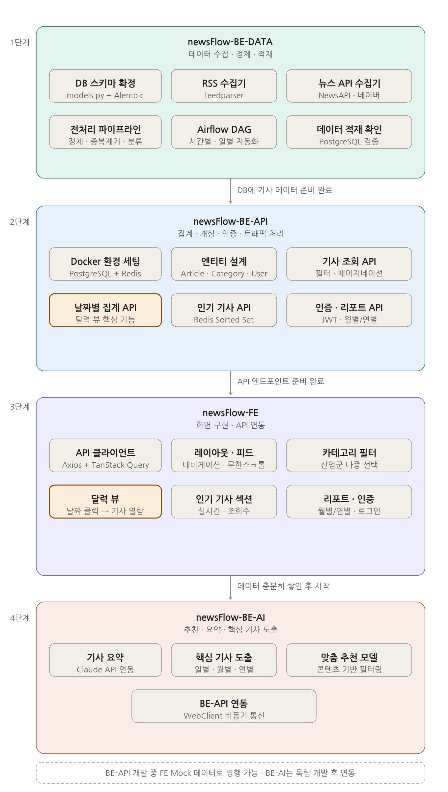

# 🗺 NewsFlow 개발 로드맵

> 혼자 개발하는 프로젝트의 전체 개발 순서와 병행 개발 일정을 정리한 문서입니다.

---

## 📌 개발 원칙

```
BE-DATA → BE-API → FE → BE-AI
  ↑           ↑        ↑      ↑
데이터 확보  API 구축  화면  고도화
```

- 각 단계가 완료되어야 다음 단계를 시작할 수 있습니다.
- **날짜별 집계 API (BE-API)** 와 **달력 뷰 (FE)** 가 이 프로젝트의 핵심 차별점입니다.
- BE-AI는 데이터가 충분히 쌓인 후 시작합니다.

---

## 🔄 전체 개발 플로우



---

## 1️⃣ 1단계 — newsFlow-BE-DATA

> 데이터가 없으면 아무것도 시작할 수 없습니다. 가장 먼저 개발합니다.

| 순서 | 작업 | 설명 | 상태 |
|------|------|------|------|
| 1 | DB 스키마 확정 | `models.py` 작성 + Alembic 마이그레이션 세팅 | 📋 예정 |
| 2 | RSS 수집기 구현 | `feedparser` 기반 RSS/Atom 피드 수집 | 📋 예정 |
| 3 | 뉴스 API 수집기 구현 | NewsAPI · 네이버 뉴스 API 연동 | 📋 예정 |
| 4 | 전처리 파이프라인 구현 | 정제 → 중복제거 → 산업군 분류 | 📋 예정 |
| 5 | Airflow DAG 연결 | 시간별 수집 / 일별 집계 자동화 | 📋 예정 |
| 6 | 데이터 적재 확인 | PostgreSQL에 실제 기사 데이터 적재 검증 | 📋 예정 |

**완료 조건:** PostgreSQL에 기사 데이터가 정상적으로 적재되는 것 확인

---

## 2️⃣ 2단계 — newsFlow-BE-API

> 1단계 완료 후 시작. 단, DB 스키마 확정 즉시 엔티티 설계는 병행 가능.

| 순서 | 작업 | 설명 | 상태 |
|------|------|------|------|
| 1 | Docker 환경 세팅 | PostgreSQL + Redis 컨테이너 실행 | 📋 예정 |
| 2 | 엔티티 설계 | `Article`, `Category`, `User` JPA 엔티티 | 📋 예정 |
| 3 | 기사 조회 API | 카테고리 필터 + Cursor 페이지네이션 | 📋 예정 |
| 4 | **날짜별 집계 API** ⭐ | 달력 뷰 핵심 — 날짜별 기사 집계 엔드포인트 | 📋 예정 |
| 5 | 인기 기사 API | Redis Sorted Set 기반 실시간 랭킹 | 📋 예정 |
| 6 | 조회수 API | Redis incr → 배치 DB 반영 | 📋 예정 |
| 7 | 사용자 인증 API | Spring Security + JWT | 📋 예정 |
| 8 | 월별·연별 리포트 API | 기간별 주요 기사 도출 엔드포인트 | 📋 예정 |
| 9 | Swagger 문서 작성 | SpringDoc OpenAPI 명세 자동화 | 📋 예정 |

**완료 조건:** Swagger에서 전체 API 엔드포인트 정상 응답 확인

---

## 3️⃣ 3단계 — newsFlow-FE

> BE-API가 50% 완성(기사 조회 API)되면 시작 가능. Mock 데이터로 병행 개발 권장.

| 순서 | 작업 | 설명 | 상태 |
|------|------|------|------|
| 1 | API 클라이언트 세팅 | Axios 인스턴스 + TanStack Query 설정 | 📋 예정 |
| 2 | 레이아웃 · 네비게이션 | 공통 레이아웃, 사이드바, 헤더 구현 | 📋 예정 |
| 3 | 뉴스 피드 메인 화면 | 무한 스크롤 기사 목록 | 📋 예정 |
| 4 | 카테고리 필터 | 산업군 다중 선택 필터 UI | 📋 예정 |
| 5 | **달력 뷰** ⭐ | 날짜 클릭 → 해당일 기사 열람 핵심 기능 | 📋 예정 |
| 6 | 실시간 인기 기사 섹션 | 실시간 · 조회수 탭 피드 | 📋 예정 |
| 7 | 월별·연별 리포트 화면 | Recharts 기반 트렌드 차트 + 주요 기사 | 📋 예정 |
| 8 | 로그인 · 회원가입 | React Hook Form + Zod 유효성 검사 | 📋 예정 |

**완료 조건:** 달력 뷰에서 날짜 클릭 시 해당일 기사 목록 정상 렌더링 확인

---

## 4️⃣ 4단계 — newsFlow-BE-AI

> 데이터가 충분히 쌓인 후 독립적으로 개발. BE-API 연동은 마지막에 진행.

| 순서 | 작업 | 설명 | 상태 |
|------|------|------|------|
| 1 | 기사 요약 | Claude API 기반 3줄 요약 생성 | 📋 예정 |
| 2 | 핵심 기사 도출 | 일별 · 월별 · 연별 Top N 선별 알고리즘 | 📋 예정 |
| 3 | 맞춤 추천 모델 | 콘텐츠 기반 + 협업 필터링 | 📋 예정 |
| 4 | BE-API 연동 | WebClient 비동기 통신 연결 | 📋 예정 |

**완료 조건:** BE-API를 통해 추천 기사가 FE에 정상 표시 확인

---

## 🔀 병행 개발 가이드

### 가능한 병행 조합

| 병행 조합 | 조건 | 방법 |
|-----------|------|------|
| BE-DATA + BE-API 엔티티 설계 | DB 스키마 확정 직후 | 스키마 공유 후 JPA 엔티티 동시 작업 |
| BE-API + FE | 기사 조회 API 1개 완성 시 | FE에서 Mock 데이터로 화면 개발 선행 |
| BE-AI | 언제든지 독립 개발 가능 | 연동은 3단계 완료 후 진행 |

### 개발 시 주의사항

- `BE-DATA`의 DB 스키마가 변경되면 `BE-API`의 엔티티도 함께 수정 필요
- `BE-API`의 응답 형식이 변경되면 `FE`의 API 클라이언트 타입도 함께 수정 필요
- `BE-AI`는 독립 서버이므로 `BE-API`와 인터페이스(요청/응답 스펙)만 사전에 합의

---

## 📊 상태 범례

| 아이콘 | 의미 |
|--------|------|
| 📋 예정 | 아직 시작 전 |
| 🔄 진행 중 | 현재 개발 중 |
| 👀 검토 중 | 코드 리뷰 또는 테스트 중 |
| ✅ 완료 | 개발 완료 |
